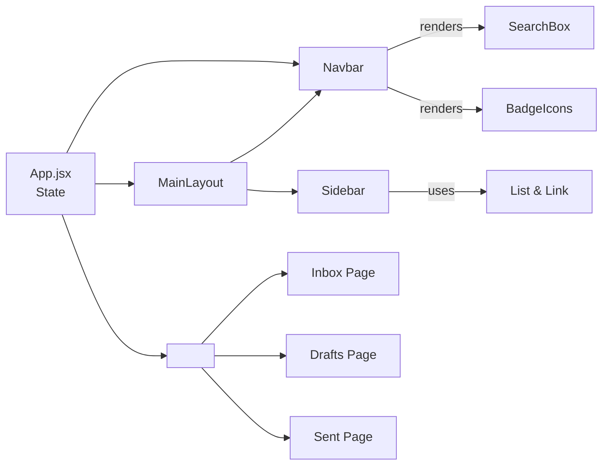

# 📧 MyMail MUI — React Email Client

<!--  -->

**A full-featured email client UI built with React and Material-UI (MUI)**

[](https://react.dev/)
[](https://mui.com/)
[](https://reactrouter.com/)
[](#-license)

---

## 📌 Table of Contents

- [About the Project](#-about-the-project)
- [Features](#-features)
- [Screenshots](#-screenshots)
- [Tech Stack](#️-tech-stack)
- [Project Structure](#-project-structure)
- [Pages & Components](#-pages--components)
- [State Management](#️-state-management)
- [Key Code Snippets](#-key-code-snippets)
- [Configuration](#️-configuration)
- [Component Diagrams](#-component-diagrams)
- [Responsive Design](#-responsive-design)
- [Getting Started](#-getting-started)
- [Available Scripts](#-available-scripts)
- [Code Style](#-code-style)
- [Testing](#-testing)
- [Deployment](#-deployment)
- [Future Enhancements](#-future-enhancements)
- [Contributing](#-contributing)
- [Acknowledgements](#-acknowledgements)
- [License](#-license)

---

## 📖 About the Project

**MyMail MUI** is a full-featured email client interface built with **React** and **Material-UI (MUI)**. It provides Inbox, Starred, Drafts, Sent, and Trash views inside a responsive layout — a permanent sidebar on desktop/tablet and a swipeable temporary drawer on mobile — along with an intuitive compose → save draft → send workflow.

Shared state (`emails`, `drafts`, `sentEmails`) lives in `App.jsx` and flows down to pages and components via props. Navigation is handled by **React Router**, and the whole UI is built with accessibility in mind — keyboard navigation, `aria-label`s on icon-only buttons, and WCAG-aligned focus styling. MyMail MUI is compatible with **MUI v6/v7 and beyond**.

---

## ✨ Features

### 📱 Responsive Layout

- Adapts to all screen sizes using MUI's recommended drawer pattern: a **temporary** drawer for small screens, a **permanent** drawer for wider ones
- On desktop/tablet, the **Sidebar** is permanently pinned to the left
- On mobile, the sidebar becomes a swipeable **Drawer** triggered by the navbar's hamburger icon

### 🔔 Dynamic Badges

- Navbar icons (Inbox, Drafts, Starred, Notifications) use MUI's `<Badge>` component to display live counts
- Badges auto-hide when their count is zero (overridable with `showZero`)
- Each badge includes a descriptive `aria-label` (e.g. `"Inbox, 4 unread messages"`) for screen readers

### ✉️ Drafts Workflow

- **Save Draft** stores the in-progress email in shared state and lists it on the **Drafts** page
- Clicking a draft re-opens it inside the Compose form for editing (pre-filled via `useEffect`)
- Sending a draft moves it to **Sent** and removes it from **Drafts**

### ✍️ Compose & Send Flow

- `Compose` is a fully controlled form (`to`, `subject`, `body` via `useState`)
- A single `handleChange` updates the right field using each `<TextField>`'s `name` prop
- `onSaveDraft` and `onSend` handlers are passed down as props from `App.jsx`

### ♿ Keyboard & Accessibility

- Built entirely with MUI's WAI-ARIA-compliant components, supporting Tab and arrow-key navigation
- Icon-only buttons (profile, notifications, etc.) include `aria-label` attributes
- Focus styling applied to list items and buttons per WCAG guidelines

### 🎨 Material-UI Compatibility

- Uses MUI's `AppBar`, `Drawer`, `List`, `Button`, and more
- Follows modern MUI patterns — e.g. `<ListItemButton>` inside lists rather than the deprecated `ListItem button` prop
- All components are themable via MUI's `<ThemeProvider>`

### 🧭 React Router Navigation

- Routes: `/` (Inbox), `/starred`, `/drafts`, `/sent`, `/trash`
- `<Link>` components handle navigation without full page reloads, preserving the SPA experience

---

## 📸 Screenshots

<!-- ### 📥 Inbox (Desktop) -->
<!--  -->

<!-- ### 📱 Sidebar Drawer (Mobile) -->
<!--  -->

<!-- ### ✍️ Compose Dialog -->
<!--  -->

<!-- ### 📝 Drafts List -->
<!--  -->

_Screenshots coming soon._

---

## 🛠️ Tech Stack

| Technology                         | Version           | Purpose                                                             |
| ---------------------------------- | ----------------- | ------------------------------------------------------------------- |
| **React**                          | 18+ (recommended) | Core UI library — functional components & hooks                     |
| **React Router**                   | v6+               | Declarative client-side routing                                     |
| **Material-UI (MUI)**              | v6+ / v7+         | Component library & theming (AppBar, Drawer, List, TextField, etc.) |
| **Node.js**                        | ≥14.x             | Development server & build process                                  |
| **npm / Yarn**                     | —                 | Package management                                                  |
| **ESLint / Prettier** _(optional)_ | —                 | Linting and code formatting                                         |

---

## 📁 Project Structure

```
MyMail/
├── public/
│   └── index.html
│
├── src/
│   ├── components/
│   │   ├── Navbar.jsx           → App bar: menu icon, search, compose/drafts/starred/notification icons
│   │   ├── Sidebar.jsx          → Navigation links (Inbox, Starred, Drafts, Sent, Trash); permanent/temporary drawer
│   │   └── MainLayout.jsx       → Wraps the app in Navbar + Sidebar, flex layout
│   │
│   ├── pages/
│   │   ├── Inbox.jsx            → Lists emails
│   │   ├── Drafts.jsx           → Lists saved drafts
│   │   ├── Sent.jsx             → Lists sent emails
│   │   ├── Trash.jsx            → Lists deleted emails
│   │   └── Compose.jsx          → Controlled compose form (new email or editing a draft)
│   │
│   ├── Data/
│   │   └── emails.js            → Initial/seed email data
│   │
│   ├── App.jsx                  → Root component — holds shared state & <Routes>
│   └── index.js                 → Entry point, renders <App> inside <Router>
│
├── .env                          → (optional) environment variables
├── package.json
└── README.md
```

This is a **component-based architecture**: the App container holds shared state (email lists) and passes it down via props to a Navbar, Sidebar, and page components (Inbox, Drafts, Sent, Trash, and the Compose dialog).

---

## 📄 Pages & Components

### `App.jsx`

- Holds `emails`, `drafts`, and `sentEmails` state via `useState`
- Defines handlers `saveDraft` and `sendEmail`, passed down to `Compose` and the relevant pages
- Sets up `<Routes>` for React Router

### `MainLayout.jsx`

- Wraps the app with `<Navbar>` and `<Sidebar>` in a flex-row layout — sidebar and main content sit side-by-side, with the Navbar spanning the top of the content column
- Computes `isMobile` via `useMediaQuery(theme.breakpoints.down('md'))` and switches the Sidebar's `variant` between `"permanent"` and `"temporary"` accordingly

### `Navbar.jsx`

- App bar with a menu icon (mobile sidebar toggle), title, search field, and icon buttons (compose, drafts, starred, notifications, profile)
- Props: `onMenuClick`, `onSearch`, `unreadCount`, `draftCount`, `starredCount`, `isMobile`

### `Sidebar.jsx`

- Navigation links: Inbox, Starred, Drafts, Sent, Trash
- Renders as a **permanent** Drawer on desktop, a **temporary** Drawer (opens via `open={true}`) on mobile

### `Inbox.jsx` / `Sent.jsx` / `Trash.jsx`

- Map over `emails` / `sentEmails` and render subject, sender, and a preview snippet per row

### `Drafts.jsx`

- Lists saved drafts with subject, recipient, and a body snippet, each tagged with a "Draft" label
- Clicking a draft calls `onOpenDraft(draft)` to load it into `Compose`

### `Compose.jsx`

- Controlled form accepting a `draft` prop (for editing) plus `onSaveDraft` and `onSend` callbacks
- All fields (`to`, `subject`, `body`) share one state object, updated through a single `handleChange`

---

## 🗂️ State Management

MyMail MUI uses **React's built-in state** (`useState` in `App.jsx`) rather than an external state library — state is lifted to the root and passed down via props.

| State        | Shape                        | Owned by  |
| ------------ | ---------------------------- | --------- |
| `emails`     | array of email objects       | `App.jsx` |
| `drafts`     | array of draft email objects | `App.jsx` |
| `sentEmails` | array of sent email objects  | `App.jsx` |

Derived badge counts (computed in `App.jsx`, passed down to `Navbar` via `MainLayout`):

```javascript
unreadCount = emails.filter((e) => !e.read).length;
draftCount = drafts.length;
starredCount = emails.filter((e) => e.starred).length;
```

### Navbar & MainLayout Props

| Prop             | Navbar usage                                  | MainLayout usage                                   |
| ---------------- | --------------------------------------------- | -------------------------------------------------- |
| `onMenuClick`    | Toggles the mobile sidebar (hamburger button) | Also toggles the Sidebar's `open` state            |
| `onSearch`       | Callback for the search field's `onChange`    | Passed to Navbar to filter emails                  |
| `unreadCount`    | Displayed in the Notifications badge          | Sourced from `App.jsx` state                       |
| `draftCount`     | Displayed in the Drafts badge                 | Sourced from `drafts.length`                       |
| `starredCount`   | Displayed in the Starred badge                | Sourced from `App.jsx` state                       |
| `isMobile`       | Hides the hamburger icon on large screens     | Computed via `useMediaQuery`                       |
| `open`           | —                                             | Controls `<Sidebar open={open}>` in temporary mode |
| `onSidebarClose` | —                                             | Closes the Sidebar drawer on mobile                |

---

## 💻 Key Code Snippets

### `App.jsx` — Shared State

```javascript
const [emails, setEmails] = React.useState(initialEmails); // all emails
const [drafts, setDrafts] = React.useState([]); // saved drafts
const [sentEmails, setSentEmails] = React.useState([]);

const saveDraft = (email) => {
  setDrafts((prev) => {
    const exists = prev.some((d) => d.id === email.id);
    if (exists) {
      return prev.map((d) => (d.id === email.id ? email : d));
    }
    return [...prev, email];
  });
};

const sendEmail = (email) => {
  setSentEmails((prev) => [
    ...prev,
    { ...email, sentAt: new Date().toISOString() },
  ]);
  setDrafts((prev) => prev.filter((d) => d.id !== email.id)); // remove from drafts
};
```

### `Compose.jsx` — Controlled Form

```javascript
function Compose({ draft, onSaveDraft, onSend }) {
  const [email, setEmail] = React.useState({
    id: Date.now(),
    to: "",
    subject: "",
    body: "",
  });

  React.useEffect(() => {
    if (draft) setEmail(draft); // editing an existing draft
  }, [draft]);

  const handleChange = (e) => {
    const { name, value } = e.target;
    setEmail((prev) => ({ ...prev, [name]: value }));
  };

  return (
    <Box>
      <TextField
        name="to"
        label="To"
        value={email.to}
        onChange={handleChange}
        fullWidth
      />
      <TextField
        name="subject"
        label="Subject"
        value={email.subject}
        onChange={handleChange}
        fullWidth
      />
      <TextField
        name="body"
        label="Body"
        value={email.body}
        onChange={handleChange}
        fullWidth
        multiline
        minRows={6}
      />
      <Button onClick={() => onSaveDraft(email)}>Save Draft</Button>
      <Button variant="contained" onClick={() => onSend(email)}>
        Send
      </Button>
    </Box>
  );
}
```

### `Drafts.jsx` — Draft List

```javascript
function Drafts({ drafts, onOpenDraft }) {
  return (
    <List>
      {drafts.map((draft) => (
        <ListItem key={draft.id} disablePadding>
          <ListItemButton onClick={() => onOpenDraft(draft)}>
            <ListItemAvatar>
              <Avatar>
                <DraftsOutlinedIcon />
              </Avatar>
            </ListItemAvatar>
            <ListItemText
              primary={draft.subject || "(No subject)"}
              secondary={`To: ${draft.to || "No recipient"} — ${draft.body?.slice(0, 60) || ""}${draft.body?.length > 60 ? "…" : ""}`}
            />
            <Typography variant="caption" color="error" sx={{ ml: 2 }}>
              Draft
            </Typography>
          </ListItemButton>
        </ListItem>
      ))}
    </List>
  );
}
```

### `MainLayout.jsx` — Sidebar/Navbar Layout

```javascript
function MainLayout({
  open,
  onMenuClick,
  onSidebarClose,
  onSearch,
  unreadCount,
  draftCount,
  starredCount,
  children,
}) {
  const theme = useTheme();
  const isMobile = useMediaQuery(theme.breakpoints.down("md"));

  return (
    <Box sx={{ display: "flex", minHeight: "100vh" }}>
      <CssBaseline />
      <Sidebar
        open={open}
        onClose={onSidebarClose}
        variant={isMobile ? "temporary" : "permanent"}
      />

      <Box
        sx={{ flex: 1, display: "flex", flexDirection: "column", minWidth: 0 }}
      >
        <Navbar
          onMenuClick={onMenuClick}
          onSearch={onSearch}
          unreadCount={unreadCount}
          draftCount={draftCount}
          starredCount={starredCount}
          isMobile={isMobile}
        />
        <Box component="main" sx={{ flex: 1, p: 3, overflow: "auto" }}>
          {children}
        </Box>
      </Box>
    </Box>
  );
}
```

---

## ⚙️ Configuration

- **Sidebar breakpoint** — controlled by `useMediaQuery(theme.breakpoints.down('md'))` in `MainLayout.jsx`. Change `'md'` to `'sm'` (or another breakpoint) to adjust when the sidebar switches between permanent and temporary.
- **Badge sources** — counts are derived from state arrays in `App.jsx` (`unreadCount`, `draftCount`, `starredCount`). Update the derivation logic there to change how counts are computed.
- **Theme customization** — wrap the app in MUI's `<ThemeProvider>` with a custom theme to override colors, typography, and more.
- **Environment variables** — MyMail MUI ships as a frontend-only app with static data, so no `.env` is required by default. Add variables like `REACT_APP_API_URL` if you wire up a backend.

---

## 🧩 Component Diagrams

**Component relationships:**



**Draft → Send workflow:** a draft is saved to shared state, appears on the Drafts page, and moves to Sent once the user clicks Send from the Compose form. _(Add a rendered diagram or screenshot here if you'd like one included.)_

---

## 📱 Responsive Design

| Breakpoint                      | Sidebar behavior                                                 |
| ------------------------------- | ---------------------------------------------------------------- |
| `md` and above (desktop/tablet) | **Permanent** drawer, pinned to the left                         |
| Below `md` (mobile)             | **Temporary** swipeable drawer, toggled via the navbar hamburger |

Adjust the threshold in `MainLayout.jsx` by changing the `theme.breakpoints.down('md')` call to `'sm'` or another MUI breakpoint.

---

## 🚀 Getting Started

### Prerequisites

- **Node.js** ≥ 14.x
- **npm** or **Yarn**

### Installation

```bash
# 1. Clone the repository
git clone https://github.com/yourusername/MyMail.git
cd MyMail

# 2. Install dependencies
npm install
# or
yarn install
```

---

## 📜 Available Scripts

| Script           | Description                                                        |
| ---------------- | ------------------------------------------------------------------ |
| `npm start`      | Starts the development server (`http://localhost:3000` by default) |
| `npm run lint`   | Lints the codebase with ESLint _(if configured)_                   |
| `npm run format` | Formats the codebase with Prettier _(if configured)_               |
| `npm test`       | Runs the test suite _(if tests are added)_                         |
| `npm run build`  | Builds an optimized production bundle                              |

_(Adjust commands if you use Yarn or custom scripts.)_

### Usage

1. Run `npm start` and open `http://localhost:3000` — the **Inbox** loads by default
2. Use the sidebar links (or navbar icons) to switch between Inbox, Starred, Drafts, Sent, and Trash
3. On mobile/tablet, tap the hamburger icon to open the sidebar drawer
4. Click the **Mail**/Compose icon to open the compose form and fill in _To_, _Subject_, and _Body_
5. Click **Save Draft** to store it without sending — it appears in the **Drafts** list with a "Draft" tag
6. Click a draft to re-open it in Compose, pre-filled for editing
7. Click **Send** to move the email to **Sent** and remove it from **Drafts**
8. Use the search field in the navbar to filter inbox items _(if implemented)_

---

## 🎨 Code Style

- **Linting** — ESLint with recommended React rules; run `npm run lint`
- **Formatting** — Prettier (print width 80, single quotes, semicolons); run `npm run format` or format on save
- **Commit messages** — [Conventional Commits](https://www.conventionalcommits.org/), e.g.:
  - `feat: add email drafting functionality`
  - `fix: resolve sidebar toggle issue`
  - `docs: update README installation steps`
- **Branch naming** — descriptive names, e.g. `feature/draft-workflow`, `bugfix/sidebar-layout`

---

## 🧪 Testing

- Component and integration tests are encouraged via **React Testing Library** using **Vitest**
- Suggested coverage: saving a draft updates `Drafts.jsx`, sending an email moves it to `Sent.jsx`, routing works correctly via `MemoryRouter`
- Run tests with:

```bash
npm test
```

---

## 📦 Deployment

```bash
npm run build
npx serve -s build    # or your preferred static server
```

This produces an optimized `/build` folder — serve it with any static host or integrate it into your deployment pipeline (GitHub Pages, Netlify, Vercel, etc.).

---

## 🔮 Future Enhancements

- [ ] Backend/API integration (currently frontend-only with static data)
- [ ] Email search implementation
- [ ] Starred/Trash actions wired up end-to-end
- [ ] User authentication
- [ ] Rich text formatting in Compose
- [ ] Attachments support
- [ ] Dark mode via MUI `<ThemeProvider>`
- [ ] Automated test suite (React Testing Library / Jest)

---

## 🤝 Contributing

Contributions are welcome!

- **Issues** — open an issue with a clear title and description for bugs or feature requests
- **Pull Requests** — fork the repo, work in a feature branch, and submit a PR with a clear description and links to related issues
- **Review process** — all PRs should pass linting (`npm run lint`) and formatting checks before merging

---

## 🙌 Acknowledgements

- UI components and theming powered by [Material-UI (MUI)](https://mui.com/)
- Navigation powered by [React Router](https://reactrouter.com/)

---

## 📃 License

This project is released under the **MIT License**.

```
MIT License

Copyright (c) 2026 Yash Tagad

Permission is hereby granted, free of charge, to any person obtaining a copy...
```

---

_📧 MyMail MUI — A practice project exploring MUI's layout, theming, and accessibility patterns_
